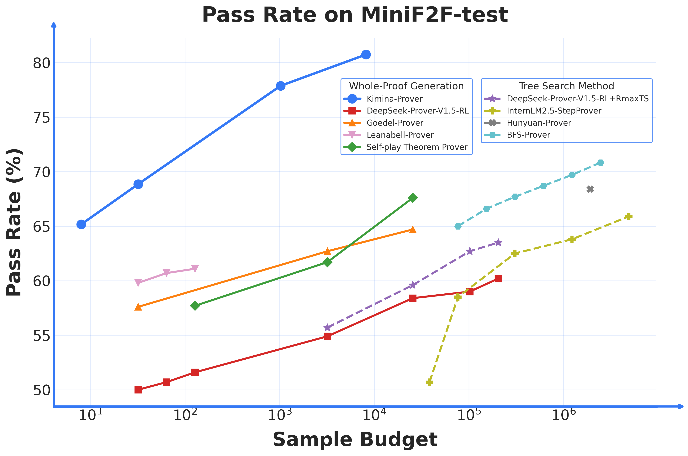
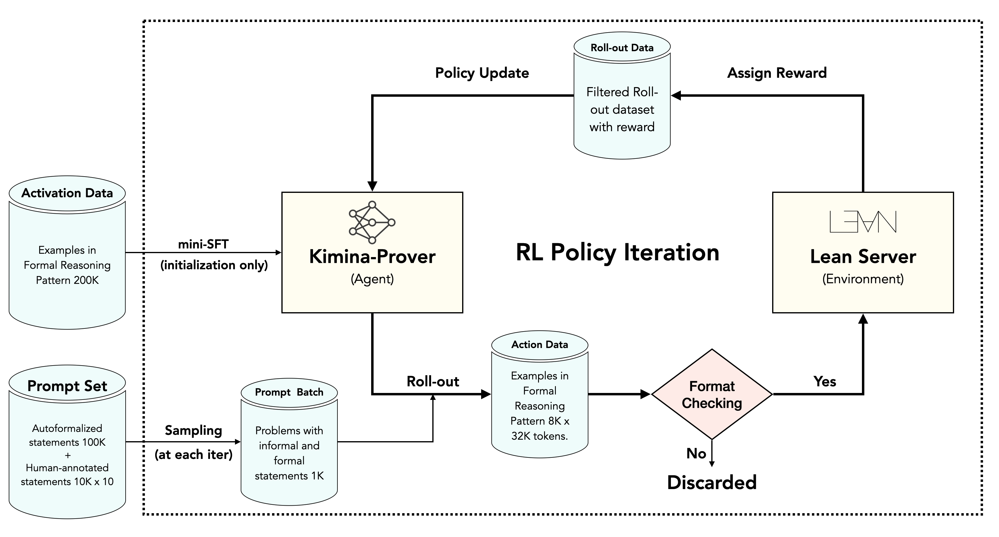
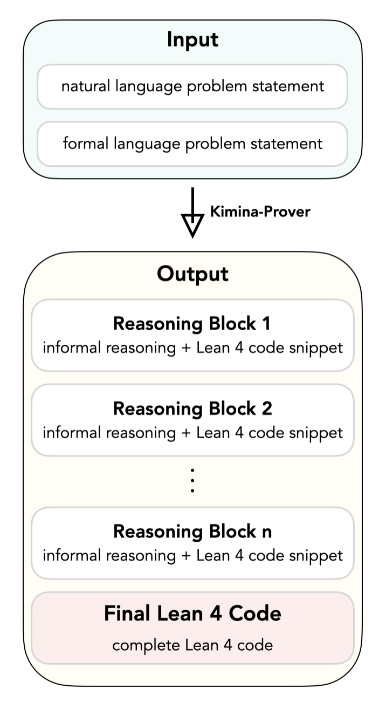

# Kimina-Prover Preview: Towards Large Formal Reasoning Models with Reinforcement Learning

<p align="center">
  <b> Numina & Kimi Team</b></a>
</p>

<div align="center">  
  <a href="https://arxiv.org/abs/2504.11354"><b>Tech Report</b></a>  |   
  <a href="https://huggingface.co/collections/AI-MO/kimina-prover-preview-67fb536b883d60e7ca25d7f9"><b>HuggingFace</b>
  </a> 
  | 🧮 <a href="https://demo.projectnumina.ai/"> <b> Demo</b></a> 
  | <a href="https://github.com/project-numina/kimina-lean-server"><b>Kimina Lean Server</b></a>
  | 🔢 <a href="https://github.com/MoonshotAI/CombiBench"><b>CombiBench</b></a>
</div>
<br>

<div style="border-left: 4px solid #007bff; padding: 3px; margin: 20px 0; font-size: 16px;">

**🚀 UPDATE - Jul 10, 2025**

We are excited to announce the official release of **Kimina-Prover-72B**! For detailed information about this release, please check out our **[blog post](https://huggingface.co/blog/AI-MO/kimina-prover)**.

</div>

---

📈 Introducing **Kimina-Prover Preview**, the first large formal reasoning model that can reason in a human-like way and prove mathematical theorems rigorously in the Lean 4 language.

- **SotA performance**: It achieves 80%+ pass rate on miniF2F benchmark for the first time, among all published results. It outperforms all prior works such as BFS-Prover (72.9%, previous SotA), Hunyuan-Prover, DeepSeek-Prover and Leanabelle-Prover by a large margin.
- **High Sample Efficiency**: Kimina-Prover Preview delivers strong results even with very small sample budget, e.g.  68.85% on pass@32 and 65.16% on pass@8.
- **Open Source**: We release two distilled versions of our RL model and one autoformalization model on [Hugging Face](https://huggingface.co/collections/AI-MO/kimina-prover-preview-67fb536b883d60e7ca25d7f9). We also release a rectified version of miniF2F-test as our model helps to identify at least 5 problems in the miniF2F-test dataset that were wrongly formalized. All proofs found by Kimina-Prover Preview in miniF2F-test are also released in [this repo](minif2f_test_solved.zip) (zipped to avoid contamination).
Lastly, we release [Kimina Lean Server](https://github.com/project-numina/kimina-lean-server), the workhorse Lean server used during the entire training process of Kimina-Prover. 


<p align="center">
    
</p>


## Key Ingredients of Kimina-Prover Preview

<p align="center">
  
</p>

Some key ingredients about the design and training of Kimina-Prover Preview are listed as follows.


- **Whole-proof Generation Enhanced by RL**: All proofs are generated without any prover feedback during training and test. And consistent with the results of Kimi k1.5, we show that strong performance can be achieved without relying on more complex techniques such as Monte Carlo tree search, value functions, and process reward models.
-  **Model Size Scaling**: Our experiments demonstrate performance scaling with model size, a trend previously unobserved for neural theorem provers. Specifically, a model size of 72B is applied and much stronger performance is obtained compared to models of smaller size.
- **Long Context Scaling**: We adopt a context window of RL up to 32K tokens for training and inference, which is the longest context used in the neural theorem proving community.
- **Distinct Reasoning Style**: We carefully design a reasoning style that we call *Formal Reasoning Pattern* that bridges the gap between formal verification and informal mathematical intuition.
  <p align="center">
      
  </p>


## Citation
```
@article{kimina_prover_2025,
	title = {Kimina-Prover Preview: Towards Large Formal Reasoning Models with Reinforcement Learning},
	author = {Wang, Haiming and Unsal, Mert and Lin, Xiaohan and Baksys, Mantas and Liu, Junqi and Santos, Marco Dos and Sung, Flood and Vinyes, Marina and Ying, Zhenzhe and Zhu, Zekai and Lu, Jianqiao and Saxcé, Hugues de and Bailey, Bolton and Song, Chendong and Xiao, Chenjun and Zhang, Dehao and Zhang, Ebony and Pu, Frederick and Zhu, Han and Liu, Jiawei and Bayer, Jonas and Michel, Julien and Yu, Longhui and Dreyfus-Schmidt, Léo and Tunstall, Lewis and Pagani, Luigi and Machado, Moreira and Bourigault, Pauline and Wang, Ran and Polu, Stanislas and Barroyer, Thibaut and Li, Wen-Ding and Niu, Yazhe and Fleureau, Yann and Hu, Yangyang and Yu, Zhouliang and Wang, Zihan and Yang, Zhilin and Liu, Zhengying and Li, Jia},
	year = {2025},
	url = {http://arxiv.org/abs/2504.11354},
}
```
